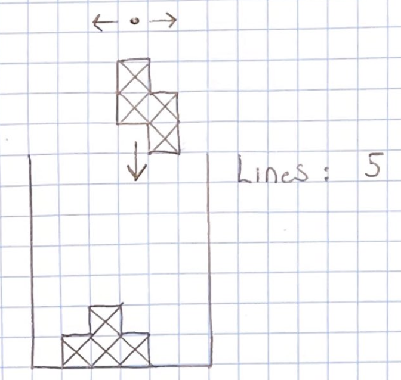

# Clojure for Software Engineers
### By Matt Morten

## Introduction

[Clojure](https://clojure.org/) is a modern, [functional](https://en.wikipedia.org/wiki/Functional_programming), 
[Lisp](https://en.wikipedia.org/wiki/Lisp_
(programming_language)) programming language that runs primarily on the 
[Java Virtual Machine](https://en.wikipedia.org/wiki/Java_virtual_machine). It has built-in interoperability with 
[Java](https://en.wikipedia.org/wiki/Java_(software_platform)), such that Clojure code can call Java code and 
libraries directly.

Learning Clojure will give you an understanding of one of the world's best programming languages, as well as a new 
was of thinking about software development.

## Audience
If you:

* Know at least 1 other programming language (Java, JS, Python etc.)
* Are interested in Clojure
* Enjoy building a working example as you go
* Want something quick to digest and enjoyable

... then this guide might be for you.

## Building a Tetris Clone

We will be building a console-based Tetris clone, stripped down to its bare essentials, as part of this guide.

[Tetris](https://en.wikipedia.org/wiki/Tetris) is my go-to puzzle to implement whenever I attempt to learn a new language. 
It has simple rules and can be implemented in fewer than 500 LOC for most languages. Choosing the same problem to implement 
over and again lets me focus on the language first. I can quickly compare it to other solutions, and get an idea of how this 
language forces (encourages) me to think.

## Contents

- [Part 1 - Core Clojure](doc/1.md)
- [Part 2 - Using Spec to Validate your Data](doc/2.md)

## Running this code

Source is found in the `src` folder. It should be runnable as a [Leiningen](https://leiningen.org/) project

