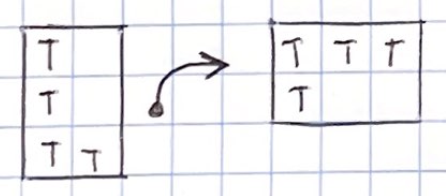
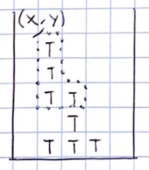
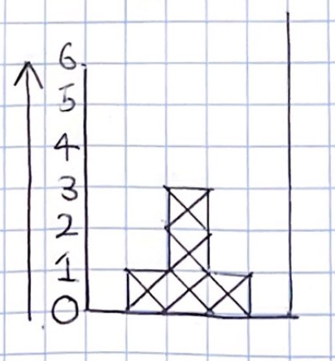
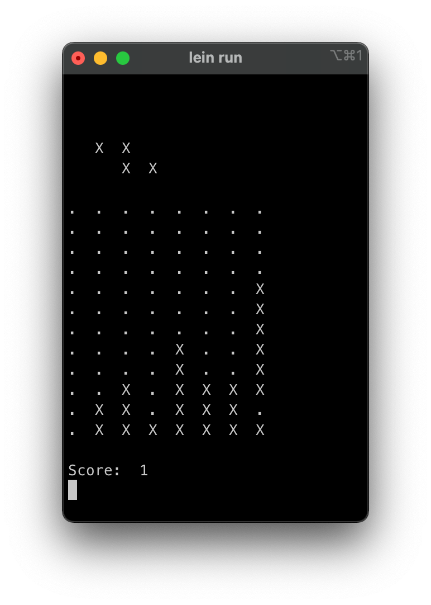

# Clojure for Software Engineers Part 1 - Core Clojure

This is part of a series [Clojure for Software Engineers](../README.md).

- **Part 1 - Core Clojure**
- [Part 2 - Using Spec to Validate your Data](2.md)


## 0. Clojure as a LISP
[Clojure](https://clojure.org/) is a List Processor (LISP). To many, Lists are associated with data not code.
Clojure code is structured as a list of lists, each containing the code to be interpreted. This seems a little abstract,
so lets look at some code:

```clojure 
;; comment
(function arg1 arg2 ... argN)
```

Lists are expressed using *parens*. Items within that list (inside the parens) are separated with whitespace. Lists
are ordered.

We submit instructions to the Clojure interpreter by supplying lists. The first element of the list is the function
name to be invoked, and the remaining items are values to be passed to the function as arguments.

```clojure
;; Print
(println "Hello World!")
=> nil

;; Addition
(+ 1 2 3)
=> 6

;; Concatenation
(str "Hello" " " "World" "!")
=> "Hello World!"

;; Lists of Lists
(str "1 plus 2 equals " (+ 1 2))
=> "1 plus 2 equals 3"
```
Since all function calls follow the same pattern, Clojure's core syntax is easy to understand.

## 1. Variable Definition
We start by defining some global variables

```clojure
(def board-width 8)
(def board-depth 12)
```
The `def` symbol is a macro. Similar to functions, we call macros in the same way. However, their control structures
can be more complex. In this case, we define our Tetris play area ("board") as an 8x12 grid.

Now to define the piece shapes:

```clojure 
(def l-piece
  [[true false]
   [true false]
   [true true]])

(def l2-piece
  [[false true]
   [false true]
   [true true]])

(def square-piece
  [[true true]
   [true true]])

(def s-piece
  [[false true true]
   [true true false]])

(def z-piece
  [[true true false]
   [false true true]])

(def line-piece
  [[true]
   [true]
   [true]
   [true]])
   
(def pieces
  [l-piece square-piece s-piece l2-piece z-piece line-piece])
```
The boolean `true` defines where a cell is filled, while `false` defines an empty cell.

We've introduced to some new syntax: `[]` square bracket notation which defines a Vector. Vectors are one of our
core datastructures in Clojure. They allow quick traversal and random access to a "sequence" of ordered data. For our
piece definition above, we use a "vector-of-vectors" or 2D vector.

## 2. Working with Vectors / Sequences
Clojure lets us define our own functions:

```clojure
(defn width                          ;; function name
  "Retrieve the width of a piece"    ;; Docstring
  [piece]                            ;; Parameter names
  (count (first piece)))             ;; Function body
 ```

The `defn` macro defines a new function within the current namespace. The above code defines a new function named
`width`, accepting a single argument `piece`. The function body will retrieve the first item in the 2D vector (the
item being a single row in our shape definition), and count the number of elements in that vector to determine the
width.

```clojure
(width l-piece)
=> 2

(width line-piece)
=> 1
```
Clojure does not have the concept of Classes or Class Methods. Many functinos in the Clojure core library are
flexible enough to handle multiple different data types. For example,
[count](https://clojuredocs.org/clojure.core/count) will count the elements in a Vector
as well as a Set, Map, String, or even Java Collection.

Lets define some more simple functions:

```clojure
(defn height
  "Retrieve the height of a piece"
  [piece]
  (count piece))

(defn column
  "Retrieve a single column from a piece or board definition"
  [piece n]
  (vec (for [row piece]
         (get row n))))
```

Here we are introduced to a new control structure - the `for` loop. It has the following behavior:

```clojure
(for
  [item sequence]
  function-body)
```

We supply two items to the [for](https://clojuredocs.org/clojure.core/for)` macro - a vector containing a variable
name to assign each single element as we
iterate through the sequence, the sequence itself - and then the function body to execute upon each iteration.

Lets describe our `column` function implementation above:

1. Iterate through the 2D array. Assign each "row" item to the variable `row`
2. For each row, get the nth item in the vector, and "return" that item

Clojure is a functional language, and as such, many of its control structures return results. The `for` macro will
return a sequence containing the "result" of each iteration. There is no
special syntax for returning a result from an iteration - the final value evaluated will be the result.

Here are some simple examples:

```clojure 
(for [x [1 2 3 4]] (+ x 1))
=> (2 3 4 5)

(for [x [1 2 3 4]]
  (+ x 10)          ;; expression is evaluated, but result is lost
  (+ x 1))
=> (2 3 4 5)
```

## 2. Lambdas and First-class Functions
We introduced `for` because of its similarity to more procedural languages. Functional languages such as Clojure
often provide functions that allow you to "map" or "reduce" over a sequence. But first, lets introduce the concept
of a function being First Class.

A function can be referred to and passed around as any other variable:

```clojure
;; The increment function is part of the Clojure Core library
(inc 1)
=> 2

;; Define a new function
(defn double-it
  [x]
  (* x 2))

(double-it 5)
=> 10

(defn do-something-with-the-number-two
  [f]
  (f 2))

(do-something-with-the-number-two inc)
=> 3

(do-something-with-the-number-two double-it)
=> 4

;; Define an anonymous function inline (lambda)
(do-something-with-the-number-two (fn [x] (* x 100)))
=> 200

;; Sugar syntax, where `%` is the function parameter
(do-something-with-the-number-two #(* % 1000))
=> 2000
```
The function `do-something-with-the-number-two` accepts a function as an argument. It calls the function, passing in
`2` and returns the result.

We can supply a core function `inc`, a function we've defined in the namespace `double-it`, or even a function
defined inline using one of two ways.

Now we go back to our `column` function from earlier. Instead of using `for`, we can use
[map](https://clojuredocs.org/clojure.core/map) to apply a function on each element of the supplied sequence, and
return a result

```clojure
(defn column
  "Retrieve a single column from a piece or board definition"
  [piece n]
  (vec (for [row piece]
         (get row n))))

(defn column-implemented-using-map
  "An alternative way of doing things"
  [piece n]
  (vec (map
         (fn [row] (get row n))
         piece)))
```

## 3. Local Variables, Range, Immutability


Let's implement some additional functions:

```clojure
(defn rotate-right
  "Returns a new piece which has been rotated 90 degrees clockwise"
  [piece]
  (let [width (width piece)
        height (height piece)]
    ;; Iterate over the columns
    (vec (for [y (range width)]
           ;; Iterate over the rows
           (vec (for [x (range height)]
                  ;; Find the position of the value we need to "transpose" into our location
                  (let [target-y (- height x 1)
                        target-x y]
                     ;; Use the `get-in` function to retrieve a value inside a nested data structure
                     ;; like our 2D vector
                     (get-in piece [target-y target-x]))))))))
```

We have a few new concepts here. The first is [range](https://clojuredocs.org/clojure.core/range), which is a  
function to generate a sequence of incrementing numbers:

```clojure
(range 5)
=> [0 1 2 3 4]
```

This is often used when trying to mimic the behavior of a classic "for-loop" (as opposed to a foreach-loop). The
following would be similar:

```clojure
(for [i (range 5)] (println i))
```
```java
for (int i = 0; i < 5; i++){
  System.out.println(i);
}
```

Next, we come across the [let](https://clojuredocs.org/clojure.core/let) keyword, which assigns values to local
variables. The variable can be referenced anywhere within the scope of the `let` call:

```clojure
(let [three (+ 1 2)]
  (str "1... 2... " three "...!"))
=> "1... 2... 3...!"

;; Multiple variables, referring to the ones before
(let [one (inc 0)
      two (inc one)]
  (str one "... " two "... 3...!" ))
=> "1... 2... 3...!"

```
We should pause here to understand that all data in Clojure is immutable, and operations on those data will create new
values that are separate from the original. The original remains untouched.

Take a look at this:

```clojure
(let [original [1 2 3 4]
      ;; increment each value in the original sequence by one
      updated (map inc original)]

  (str "Original is: " original ", updated is: " updated))
=> "Original is: [1 2 3 4], updated is: [2 3 4 5]"
```

Immutability is a core feature of many functional programming languages. It enables us to better reason with data
safely, especially in a concurrent environment.

Finally, we will write some more utility functions for our Tetris implementation, this time focussing on the play
area (the board). For each new function that you're unsure about, I would recommend you look at the
[Clojure Core library documentation](https://clojuredocs.org/clojure.core) to see how it works:

```clojure
;; More piece functions
(defn piece-coordinates
  "Produces a sequence of coordinates for each square in a piece"
  [piece]
  (for [y (range (height piece))
        x (range (width piece))]
    [x y]))

;; Board functions
(def empty-row
  "Create a new row and fill it with `false` values"
  (vec (take board-width (repeat false))))

(def empty-board
  "Create a new board with no pieces. `true` represents filled squares. The data structure is the same 
   2D vector as we use for the pieces, but larger (8 x 12)"
  (vec (for [_ (range board-depth)]
         empty-row)))

(defn valid-x?
  "Does the x-coordinate lie within the bounds of the play board?"
  [x]
  (<= 0 x (dec board-width)))

(defn rightmost-drop-position
  "Given a piece with a certain width, how far right can it be place before it goes off the board?"
  [piece]
  (- board-width (width piece)))

(defn valid-drop-position?
  "Can the piece be dropped from this x-coordinate?"
  [piece x]
  (<= x (rightmost-drop-position piece)))

(defn game-over?
  "Has any of the topmost row been filled?"
  [board]
  (boolean (some true? (first board))))
```

Note - it is idiomatic to use the `?` suffix for function names or variables that return / contain a truthy value.

## 4. Nil, If, Do, and When
`nil` is Clojure's version of the Null Value. `nil` represents no data, empty. `nil` is also "falsey", meaning it
will evaluate to false instead of true within a predicate match.

```clojure
(get [0 1 2] 10) ;; Retrieve the 10th element in the vector
=> nil

(println "Hello World!") ;; printing will return no value
=> nil

(true? nil)
=> false
```

Clojure has the [if](https://clojuredocs.org/clojure.core/if) form that works in similar ways to other languages.
Similar to `for`, it actually returns the result of the evaluated expression:

```clojure
(if (even? 10)
  "It is even"
  "It is odd")
=> "It is even"

;; Nil evaluates to false
(if nil
  "No way"
  "Nil is falsey")
=> "Nil is falsey"
```

The structure of the `if` contains 3 expressions: the predicate to evaluate, the true-branch and the false-branch.
You may be asking "what if I need to put multiple statements within one of the branches?". We can accomplish this
with `do`, which groups multiple forms together and executes them in sequence:

```clojure
(if (even? 10)
  (do
    (println "We got here")
    "It is even")
  "It is odd")
"We got here"
=> "It is even"
```

The `if` construct acts as an `if-else` in other languages. If we don't care about the else, we can use
[when](https://clojuredocs.org/clojure.core/when):

```clojure
(when (even? 4)
  "It is even")
=> "It is even"

(when (even? 5)
  "It is even")
=> nil
```
If the predicate is false, nothing is evaluated and nil is returned.


## 5. Reduce, Assoc, Destructuring

Clojure offers a [reduce](https://clojuredocs.org/clojure.core/reduce) function which iterates over a sequence in the
same way as `map`, but passes through an accumulator. The accumulator is simply the result of the previous iteration.
The result of the overall `reduce` function is the result of the final iteration.

```clojure
;; Takes the result of the previous iteration, and adds the current element. Passes that result to the next iteration
(reduce + [1 2 3])
=> 6

;; We can pass an initial value, used in the first iteration
(reduce + 10 [1 2 3])
=> 16

;; Are any of the values even?
(reduce
  (fn [accumulator item]
    (or (true? accumulator)
        (even? item)))
  false
  [3 5 6 7])
=> true
```
Clojure datas tructures are immutable. We use functions to "modify" the contents of existing sequences, but in
fact a brand new sequence is created with the changes applied:

```clojure
;; assoc takes a key and a value. The key is `1` meaning the index `1` for a vector
(assoc [5 6 7] 1 99)
=> [5 99 7]

;; update will apply the function to the value at key `1`
(update [5 6 7] 1 inc)
=> [5 7 7]
```

The final concept I want to introduce before jumping back to Tetris is [destructuring](https://blog.brunobonacci.
com/2014/11/16/clojure-complete-guide-to-destructuring/). This is syntax that we can use
to retrieve values from inside data structures:

```clojure
(let [a [1 2 3]
      ;; Destructure to retrieve the elements in the vector. Any items not present (fourth) will be nil
      [first second third fourth] a]
  (str first " " second " " third " " fourth))
=> "1 2 3 nil"

;; We can even destructure within a function definition
(defn distance
  [[source-x source-y] [destination-x destination-y]]
  (str "Distance x: " (- destination-x source-x) ", Distance y: " (- destination-y source-y)))

(distance [1 3] [5 4])
=> "Distance x: 4, Distance y: 1"
```

Phew! That's a lot. Let's put everything together to write a function which takes a board, a piece, and a pair of coordinates, and
"adds" the piece to the board. I.e. it sets the value of the cells in the board to `true` in the shape of the piece,
at the location specified. Again, Clojure data structures are immutable, to the resulting board will be a new copy of
the existing board, but with the cells filled.



```clojure
(defn place-piece-on-board
  "Add a piece to the board (fill the squares on the board that correspond with the piece at the supplied
   location)"
  [board piece x y]
  (let [list-of-coordinates-within-the-piece (piece-coordinates piece)]
      ;; For each cell in the piece
      (reduce
        ;; Destructure the x-y coordinate of that cell
        (fn [board [piece-x piece-y]]
          ;; If the cell is "filled"
          (if (get-in piece [piece-y piece-x])
              ;; Figure out where it would go on the board
              (let [target-x (+ x piece-x)
                    target-y (+ y piece-y)]
                ;; If that cell is already filled on the board, throw an exception
                (when (get-in board [target-y target-x])
                  (throw (Exception. "Overlap!")))
                ;; If it is out of bounds, don't fill and return what we already have
                (if (and (>= target-x 0) (>= target-y 0))
                  ;; Otherwise, update the board cell to true
                  (assoc-in board [target-y target-x] true)
                  board))
              board))
        board
        list-of-coordinates-within-the-piece)))
```

## 6. Threading Macro

No, this isn't *that* kind of threading (concurrency). This is the Clojure macro that can make code more
readable.

Let's take a look at [filter](https://clojuredocs.org/clojure.core/filter), which evaluates a predicate against
every element of a sequence, and only retains those elements that evaluate true:

```clojure
(filter even? [1 2 3 4 5])
=> [2 4]

;; The identity function evaluates false for nil. This has the effect of removing nil values from a sequence
(filter identity [1 nil nil 2 nil])
=> [1 2]
```

Suppose we want to do the following:

1. Filter and retain only even numbers
2. Double them
3. Sum them

Might look like:

```clojure
(reduce + (map #(* % 2) (filter even? [1 2 3 4])))
=> 12
```

This code is difficult to read and unwieldy to write. The Threading macros [->](https://clojuredocs.org/clojure.core/-%3E)
and [->>](https://clojuredocs.org/clojure.core/-%3E%3E) allow us to write this in a more "sequential" style:

```clojure
(->> [1 2 3 4]
     (filter even?)
     (map #(* % 2))
     (reduce +))
=> 12
```
This threading macro takes the first argument `[1 2 3 4]`, and "threads" it into the second form (`filter ...`) as
the last element of that form. That form evaluates, and the result is passed as the last element of the next form
(`map ...`). This goes on until the result drops out the bottom:

```clojure
(->> [1 2 3 4] ;;  ->-->-
     ;; ->-->-->---V   
     (filter even?  ) ;; ->-->-
     ;; ->-->-->---V
     (map #(* % 2)  ) ;; ->-->-
     ;; ->-->--V
     (reduce +  )) ;; ->--> result
=> 12
```

Another threading macro is `->`, which threads the results into the second element of the form
```clojure
(-> [1 2 3 4] ;;  ->-->-
    ;; --V   
    (get   2) ;; ->-->-
    ;; --V
    (inc  ) ;; ->-->-
    ;; V
    (+   10)) ;; ->--> result
=> 14
```

Armed with this knowledge, we can write a function that finds the height of all bricks placed on the board, at column x:



```clojure
(defn board-height-at
  "What is the maximum 'height' of filled squares, on the supplied board, for a particular column"
  [board x]
  (let [column (column board x)]
    (or
      ;; Start with the column (a vector of true and falses)
      (some->> column
               ;; This function supplies us with both the value, and the index (as opposed to the standard `map`)
               ;; Return the index if filled, or nil otherwise
               (map-indexed (fn [index filled?] (when filled? index)))
               ;; Remove the nils. Now we have the indexes of all filled cells
               (filter identity)
               seq
               ;; Find the minimum index
               (apply min)
               ;; Subtract it from the board depth to get the height
               (- board-depth))
      0)))
```

... and a function to see where a piece will land (the height) if dropped on the board at column x

```clojure
(defn drop-position-y
  "Given a board, a piece, and an x-coordinate to drop the piece from: at what height will the piece land
   given the currently-filled squares on the board?"
  [board piece drop-position-x]
  ;; For each column in the piece
  (->> (for [x (range (width piece))]
         (let [piece-column (column piece x)
               ;; Find the lowest filled cell within that piece
               column-depth (->> piece-column
                                 (map-indexed (fn [index filled?] (when filled? index)))
                                 (filter identity)
                                 (apply max))

                ;; Find the highest "peak" on the board
                board-height-at-column (board-height-at board (+ drop-position-x x))
                ;; Find the position Y for this column
                position-y (- board-depth board-height-at-column column-depth 1)]
           position-y))
       (apply min)))

(defn drop-piece-on-board
  "Drop a piece from location x on the board, fill the squares at the landing spot, and return the new board"
  [board piece x]
  (let [y (drop-position-y board piece x)]
    (place-piece-on-board board piece x y)))
```

## 7. Custom Loops
`for`, `map` and `reduce` are great tools for iterating over sequences. They are simple in that - they always
iterate over all items, and values are consistently passed into the function body.

For something more complex, we can use [loop](https://clojuredocs.org/clojure.core/loop) and
[recur](https://clojuredocs.org/clojure.core/recur)`:

```clojure
;; Injected variables for loop are initialized here
(loop [variable expression]
  ;; loop body can contain anything
  (something)
  ;; Use recur to re-enter the loop, with the new value defined here
  ;; Otherwise, the loop will exit
  (recur new-value-for-variable))
```

An example:

```clojure
(loop [x 0
       sum 0]
   ;; If x >= 5, break and return the sum
   (if (< x 5)
       ;; Only add the value to the sum if the value is even
       (let [sum (if (even? x) (+ sum x) sum)]
            ;; Increment x, and loop again, with the updated sum
            (recur (inc x) sum))
       sum))
=> 6
```

To implement the "clear lines on the board that are filled" logic, we will use this more complex looping structure,
since we have to both iterate through the board, and modify the board in place as we clear the lines, AND add blank
ones back into the board at the top:

```clojure
(defn clear-lines-on-board
  "Remove any completely filled lines on the board, and replace with blank lines from the top. 
   Return the new board, and the number of lines we cleared (used for scoring)"
  [board]
  (loop [board board
         ;; y is the current row we are evaluating
         y 0
         ;; used to keep track of the user's score
         lines-cleared 0]
    
    ;; if-let is a nice sugar that combines `if` and `let`.
    ;; The `let` statement is evaluated to assign a result to a variable
    ;; Then the `if` is evaluated: if the variable value is truthy, evaluate the first expression,
    ;; else the second
    ;; Here, we use if to identify when we've reached the end of the board, since `(get board y)`
    ;; will return `nil` when there are no further rows to retrieve
    (if-let [row (get board y)]
      (if (every? true? row)
        ;; We use concat to: add a new empty row to the top, and (with subvec) remove the
        ;; full row
        (let [board (vec (concat [empty-row]
                                 (subvec board 0 y)
                                 (subvec board (inc y) (count board))))]
          (recur board y (inc lines-cleared)))
        (recur board (inc y) lines-cleared))
      ;; We want to return multiple results to the caller: the new board, and the number of lines
      ;; we cleared (for scoring). Clojure doesn't support multiple return, so the easiest solution
      ;; is to return a tuple (a 2 item vector)
      [board lines-cleared])))
```

## 8. Maps

Every language worth its salt has a decent Map / Associative implementation. Clojure goes further, making the humble
Map a first-class citizen of the language:

1. Maps have their own literal syntax: `{}`
2. Maps are idiomatic - Clojure users are encouraged to use Maps for modelling data (as opposed to the "Class" or "Struct" in other languages)
3. Core library functions work on Maps perfectly: `get`, `assoc`, `update`, `map`, `filter`, `count` etc.

We cannot talk about Maps without also talking about Keywords. A Keyword is a String with added powers. It is
idiomatic to use Keywords as your Map keys when modelling data:

```clojure
;; A map with String keys
(def ages {"alice" 34 "bob" 32 "jessie" 18})

;; A map with Keyword keys
;; notice that commas are considered whitespace in Clojure. Use them to aid in formatting / readability
(def bob {:age 32, :eye-color "blue", :location "USA"})

(get ages "jessie")
=> 18

(assoc ages "chris" 27)
=> {"alice" 34 "bob" 32 "jessie" 18 "chris" 27} 

;; Keywords have a magic power: they are also a function, which can look themselves up in a map
(:location bob)
=> "USA"

;; Functions that iterate over maps will inject their key-value pair as a tuple / vector
;; In the example below, we use Destructuring to retrieve those values
(reduce
  (fn [accumulator [name age]] (+ accumulator age))
  ages)

;; In the above example, the variable name is used to destructure the tuple, but it isn't used.
;; We can use an underscore character to make it anonymous
(reduce
  (fn [accumulator [_ age]] (+ accumulator age))
  ages)
```

We have already modelled individual pieces, as well as the game board. Lets use Maps to model the overall game state
at any one time. The state will contain:

* The current board
* The next Tetris piece
* The position of the piece on the X-axis
* The score

```clojure
(defn new-state
  "The state map tracks the game state: the current board and piece, the left-right position of the hovering
   piece, and current score"
  ([board piece position]
   {:board board
    :piece piece
    :position position
    :score 0})
  ([board piece]
   (new-state board piece 0))
  ([board]
   (new-state board (rand-nth pieces) 0))
  ([]
   (new-state empty-board (rand-nth pieces) 0)))
```

There is something different about this function definition - it is overloaded. The function defines different
implementations depending on the function-arity (number of arguments supplied by the caller). So if the user calls
`new-state` function with zero arguments, the function will be called with an empty board, a random piece, and zero
score.

We will now create functions that work on the entire state map. Here is one that takes a state and returns a new one,
with the current piece rotated 90 degrees:

```clojure
(defn rotate-state
  "Update the game state by rotating the current piece 90 degrees"
  [state]
  ;; The `update` function will execute the `rotate-right` function on the value at key `:piece`,
  ;; and return a new map with the new result
  (let [state (update state :piece rotate-right)]
    ;; Retrieve data from the map using keywords as functions - it's idiomatic!
    ;; Ensure rotating the piece doesn't cause the piece to move off-screen due to its new width
    ;; The `if-not` function simply reverses the cases
    (if-not (valid-drop-position? (:piece state) (:position state))
      ;; Modify the position value inside the state, and return the state
      (assoc state :position (rightmost-drop-position (:piece state)))
      ;; else return the state as-is
      state)))
```

Let's look at a new concept - Currying. We can generate new functions by referring to existing ones, but locking some
of their arguments:

```clojure
;; The original `+` function accepts a minimum of 2 arguments
;; We can generate a new function which supplies `1` as the first argument constantly. This makes the
;; new function have a minimum of 1 argument
(def my-increment (partial + 1))

(my-increment 5)
=> 6

(def simon-says (partial str "Simon says: "))

(simon-says "Hop on one leg!")
=> "Simon says: Hop on one leg!"
```

We can now define a new function to move the current piece either left or right, and return a new state:

```clojure
;; This function accepts an argument to define the direction - left or right.
;; We can call this function directly, but we would prefer users call the curried functions below,
;; so I have prefixed the function-name with a hyphen. This tells me the function has a different access
;; point.
(defn -move-state
  "Update the game state by moving the current piece left of right"
  [movement-size state]
  (let [current-position (:position state)
        target-position (+ current-position movement-size)
        ;; The cond macro takes "pairs" of expressions. The first in the pair is evaluated for truthiness.
        ;; If truthy, the second in the pair is run and returned. Else move to the next clause
        target-position (cond 
                          ;; Valid - use the target position
                          (valid-drop-position? (:piece state) target-position) target-position
                          ;; Too far left - use zero
                          (< target-position 0) 0
                          ;; Too far right - use the rightmost valid position
                          :else (rightmost-drop-position (:piece state)))]

    (assoc state :position target-position)))

(def move-left (partial -move-state true 1))
(def move-right (partial -move-state false 1))
;; Don't move the piece, just ensure it's in a valid position
(def reset-position (partial -move-state 0))
```

We can bring it all together with a function that drops the current piece in the current location onto the board.
A new piece will then be generated, lines will be cleared, score tallied etc.

```clojure
(defn drop-state
  "Update the game state by dropping the current piece onto the board, clearing any filled lines, and
   updating the score"
  [state]
  ;; Check out this new syntax, used to destructure a map. We can extract particular keys from the map,
  ;; and make them available as local variables. In this case we are retrieving `:board`, `:piece`, and `:position` 
  ;; the state map
  (let [{:keys [board piece position]} state
        board (drop-piece-on-board board piece position)
        [board lines-cleared] (clear-lines-on-board board)]
    (-> state
        (assoc :board board)
        (assoc :piece (rand-nth pieces))
        (reset-position)
        (update :score #(+ % lines-cleared)))))
```

## 9. Side Effects, Rendering

Clojure is a functional language. Every expression is evaluated for a result. There are some exceptions to this, for
example `println` returns no result, instead producing a side effect (sending characters to standard out).

Clojure tries to be lazy. If the result of an expression is not used (discarded), Clojure may skip its execution
entirely. Consider the following case;

```clojure
(do
  (for [_ (range 5)]
    (println "Hello")) ;; will not run, since we do nothing with the output

  (+ 1 2)) ;; this result will be returned
```
Clojure may not execute the `println` function at all, since the result returned by `for` is completely discarded.

The core library includes functions which can be used with side-effecting functions:

```clojure
(dotimes [_ 5]
  (println "hello"))

(doseq [x [1 2 3 4 5]]
  (println "hello " x))
```

We want to render our game state to screen, so the user can play Tetris!

```clojure
(defn -render-board-or-piece!
  "Render the piece / board as text"
  ([board? board left-pad & {:keys [fixed-height]}]
   (let [height (height board)
         top-pad (let [fixed-height (max height (or fixed-height 0))]
                   (- fixed-height height))]
     (dotimes [_ top-pad]
       (println ""))
     (doseq [row board]
       (doseq [_ (range left-pad)]
         (print "   "))
       (doseq [cell row]
         (let [char (cond
                      cell "X"
                      board? "."
                      :else " ")]
           (print char " ")))
       (println ""))))
  ([board? board]
   (-render-board-or-piece! board? board 0)))

(def render-board! (partial -render-board-or-piece! true))
(def render-piece! (partial -render-board-or-piece! false))

(defn render-state
  "Render the entire game state"
  [{:keys [board piece position score] :as state}]
  (println "")
  (render-piece! piece position :fixed-height 4)
  (println "")
  (render-board! board)
  (println "")
  (println "Score: " score)
  state)
```

We have some new concepts here. The most important is the following:

```clojure
  ([board? board left-pad & {:keys [fixed-height]}]
```

This function signature contains Optional Arguments. We ask for them in the form of Keyword Arguements. If not
supplied, the variable will be set to `nil`. Here is how it can be called:

```clojure
(render-board! board 10 :fixed-height 5)
```

The second new concept is the use of the exclamation point `!` in the function signature. This is a naming
convention that simply signals to the user that this function is side-effecting. The result of this function is, in
this case, useless. The value is contained in the print-statements contained within.

## 10. Capturing Keyboard input

The final thing to do is capture keyboard input to allow users to play the game. We will use a 3rd party library
called Lanterna to handle this. Importing libraries into projects is different depending on whether you use
Leiningen (as this project does), Boot, or clj-deps.

```clojure
(defn play!
  []
  (let [term (t/get-terminal :text)]
    (t/start term)
    (loop [game-state (new-state)]
      (render-state game-state)
      (if (game-over? (:board game-state))
        (println "Game over!")
        (let [c (str (t/get-key-blocking term))]
          (t/clear term)
          ;; `case` is similar to a Java switch statement. The variable `c` is matched against,
          ;; and a clause chosen depending on its value
          (case c
            "x" (println "Exit")
            "i" (recur (rotate-state game-state))
            "j" (recur (move-left game-state))
            "l" (recur (move-right game-state))
            "k" (recur (drop-state game-state))
            (recur game-state)))))))

```


